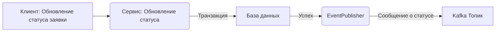

# Реализация отправки сообщений через EventPublisher

## Описание
В данной ветке реализована отправка уведомлений о статусе заявки на кредит с использованием EventPublisher (Событийного издателя). Основная идея подхода — гарантировать отправку сообщения в Kafka только после успешного завершения транзакции обновления статуса в базе данных.

## Схема взаимодействия


## Алгоритм работы
1. Клиент отправляет запрос на обновление статуса заявки.
2. Сервис обновляет статус заявки в базе данных в рамках транзакции.
3. После успешного коммита транзакции сервис вызывает EventPublisher для публикации сообщения в Kafka.
4. Kafka принимает сообщение и передает его в топик, который прослушивает Notification Service.

## Возможные проблемы
1. **Проблемы с транзакционностью:**
   Если транзакция базы данных успешно завершилась, но при публикации сообщения в Kafka произошел сбой, возможна потеря данных (несоответствие между базой данных и состоянием Kafka).

2. **Неполадки Kafka:**
   Если Kafka временно недоступна, сообщение не будет отправлено, и сервис не сможет повторить попытку.

3. **Проблемы с EventPublisher:**
   Если код EventPublisher содержит ошибки (например, неправильно настроен KafkaTemplate), сообщения могут не доходить до топика.

4. **Отсутствие гарантий доставки:**
   Публикация сообщений в Kafka не является полностью атомарной операцией. Потенциальная потеря данных возможна при сбоях.

## Пример кода

### Использование EventPublisher
```java
@Service
@RequiredArgsConstructor
public class CreditApplicationService {
   private final CreditApplicationRepository creditApplicationRepository;
   private final ApplicationEventPublisher applicationEventPublisher;
   
   @Transactional
   public CreditApplicationEntity updateStatus(UUID applicationid, CreditStatus status) {
      CreditApplicationEntity application = creditApplicationRepository.findById(applicationid)
              .orElseThrow(() -> new RuntimeException("Application not found"));
      application.setStatus(status);
      application.setUpdateAt(LocalDate.now());

      applicationEventPublisher.publishEvent(status);
      return creditApplicationRepository.save(application);
   }
}
```

```java
@Component
@RequiredArgsConstructor
public class StatusEventListener {
   private final KafkaPublisher kafkaPublisher;
   @Value("${topics.credits.status}")
   private String topic;

   @TransactionalEventListener(phase = TransactionPhase.AFTER_COMMIT)
   public void sendToNotifyService(CreditStatus status) {
      kafkaPublisher.sendStatusUpdate(topic, status.name());
   }
}
```

## Заключение
Этот подход достаточно прост в реализации и легко интегрируется в существующую систему. Однако, чтобы минимизировать риски потери данных, рекомендуется рассмотреть альтернативы, такие как Outbox или Change Data Capture (CDC), которые обеспечивают более высокую гарантию согласованности данных.

